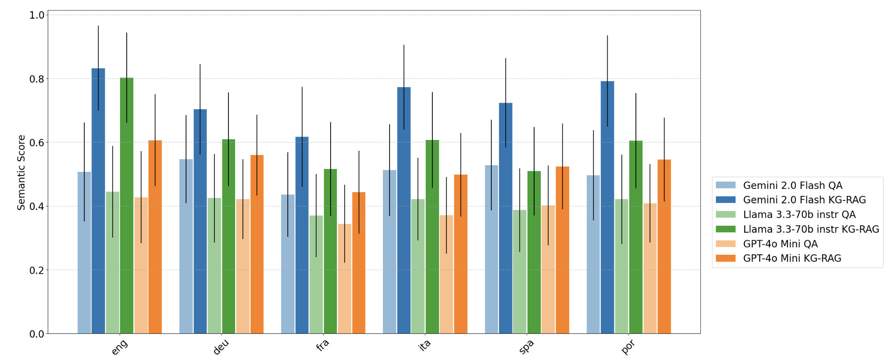

# Multihal
Multilingual, knowledge-graph grounded benchmark for evaluating factuality and knowledge injection methods for LLMs.

## Setup
Tested on Python 3.11
1. Create a Python 3.11 virtual environment, either with `venv` or `conda`.
2. Install the requirements:
```bash
python -m pip install -r requirements.txt
```
3. Create an `.env` file in the root directory with the following content:
```bash
HF_TOKEN=<YOU_HF_TOKEN>
WANDB_API_KEY=<YOUR_WANDB_API_KEY>
OPEN_ROUTER_API_KEY=<YOUR_OPEN_ROUTER_API_KEY>
```
4. Execute the code with.
```bash
python main.py --config config/default.yaml
```
The `default.yaml` file contains the default configuration to run the whole pipeline from start to finish. You can also create your own configuration file and pass it to the script to process separate stages or datasets.

The default configuration arguments and their documentation is defined in `src.utils.config.GlobalConfig.get_default_args()`. The parameters specified in `config/default.yaml` overrides the defaults, therefore you can create your own configuration files to run different experiments.

5. Output is written to `output/` directory with a timestamped folder.

## Table and Figure Generation from the Original Paper
We also supply our raw results in the `results/` directory. To generate the tables and figures from the original paper by running the `results/generate_results.ipynb` notebook. Output will be written to `results/output/` directory.

## Results
We perform our evaluation based on semantic similarity computed using sentence-transformers. The figure below shows comparisons of semantic similarity scores between `ground-truth` and `predicted` answers, for vanilla QA and KG-RAG (KG path labels as part of context). The results show consistent improvements in semantic similarity when using out mined KG paths.



## License
This project is licensed under CC-BY-4.0 license.